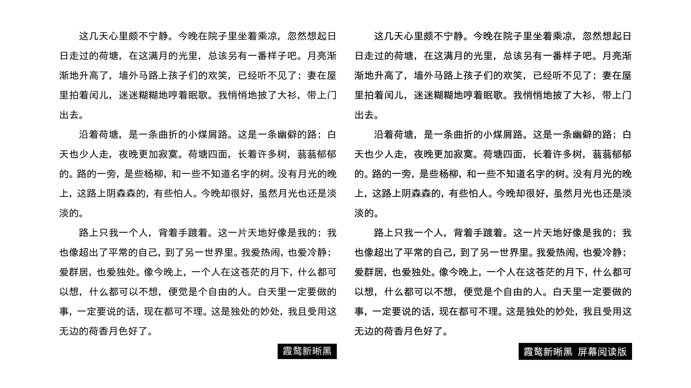
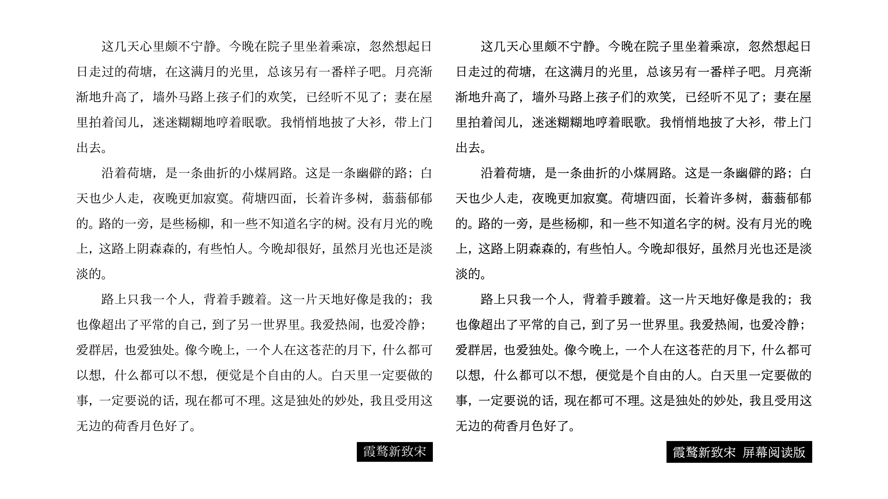

# 霞鹜新晰黑＆霞鹜新致宋 屏幕阅读版  LXGW Neo XiHei Screen & LXGW Neo ZhiSong Screen

「霞鹜新晰黑」「霞鹜新致宋」屏幕阅读版本。

## 字体介绍

本项目为[「霞鹜新晰黑」](https://github.com/lxgw/LxgwNeoXiHei)[「霞鹜新致宋」](https://github.com/lxgw/LxgwNeoZhiSong)的分支版本，在原字体基础上细微加粗，并调整度量数据与 [Roboto](https://github.com/googlefonts/roboto) 相同，更适合 PC 及 Android 系统显示。

另提供补全（Full）版，采用 [Droid Sans Fallback](https://www.maoken.com/freefonts/2428.html) 和 [Roboto v2.138](https://github.com/googlefonts/roboto) 补全。

### 制作与调整

- **霞鹜新晰黑 屏幕阅读版：** 在「霞鹜新晰黑」基础上，用 FontCreator 双向加粗 6 个单位。补全版直接采用 Roboto 和 Droid Sans Fallback 打底。
- **霞鹜新致宋 屏幕阅读版：** 在「霞鹜新致宋」基础上，用 FontLab 加粗，其中：汉字横向加粗 5 个单位，纵向加粗 16 个单位（遇笔画较多的汉字酌情减小加粗幅度）；其他字符双向加粗 8 个单位。补全版先依次用[「IPAmj 明朝」](https://moji.or.jp/mojikiban/font/)[「一点明体」](https://github.com/ichitenfont/I.Ming)[「谜乃明朝」](https://github.com/ge9/NazonoMincho)加粗后补全扩展 A 区，用 [HanaMinLite](https://github.com/Radically/hanazonolite) 补全谚文，再用 Roboto 和 Droid Sans Fallback 打底。
- **补全版**采用[「魔兽字体合并补全工具」](https://github.com/nowar-fonts/Warcraft-Font-Merger)补全。

### 概览

下图左为原版，右为屏幕阅读版。

> ㊟ 文段节选自朱自清《荷塘月色》。

## 获取字体

进入 [Releases](https://github.com/lxgw/LxgwNeoXiZhi-Screen/releases) 页面下载。

## 注意事项

由于暂时没有找到与新致宋风格契合且授权许可兼容的字体，「霞鹜新致宋 屏幕阅读版 补全」会混入大量来自 Roboto 和 Droid Sans Fallback 的黑体（无衬线体，sans-serif）字符，如拉丁字符、西里尔字符等，且补入的来自「花园明朝」的谚文会有一定的违和感。

## 授权信息

- 本字体在 IPA 所开发并发布的 [IPAex ゴシック、IPAex 明朝](https://moji.or.jp/ipafont)和 [IPAmj 明朝](https://moji.or.jp/mojikiban/font/)基础上衍生，依照 [IPA开放字型授权条款 第1.0版（IPA Font License 1.0）](https://opensource.org/licenses/IPA/) 授权。
- 您可以将本字体用于印刷品、数字文档、影视内容、海报广告、包装、出版物设计以及其他各种设计用途，包括商业和非商业用途；
  也可在本字体基础上继续改作衍生，惟衍生字体名称（包括程序名、文件名、字体名）不得包含「IPA」字样，且衍生字体须继承相同授权许可（故 IPA 字体授权许可与 SIL OFL 不兼容）。
- 根据 IPA Font License 1.0 有关条款，在没有邮费、存储媒介费用和手续费的情况下，须免费提供字体文件，不得将字体文件单独售卖。
- 如果您要将本字体替换回 IPA 原始授权字体，请从 [IPA 字体下载页面](https://moji.or.jp/ipafont/ipafontdownload)获取原始授权字体，或从[「IPAmj明朝」字体下载页面](https://moji.or.jp/mojikiban/font/)获取「IPAmj明朝」。  
  对于涉及字体文件再分发的嵌入式应用（如应用程序、硬件设备、网页等嵌入），[请点击此处](https://github.com/lxgw/LxgwNeoXiHei/blob/main/documentation/embedding_instructions.md)（跳转到「霞鹜新晰黑」repo）。
- 有关 IPA Font License 1.0 的其他常见问题，请参阅 [FAQ（日语）](https://moji.or.jp/ipafont/faq)，需自备翻译工具。
- 但凡有任何人使用、复制、修改、分发本字体，或对本字体进行任何符合 IPA Font License 1.0 规定的行为，使用、下载或行使合约规定权利之接受方，亦视为同意遵守 IPA Font License 1.0 的一切规定。  
  「IPA 字体（IPA Font，IPAフォント）」为日本「独立行政法人　信息处理推进机构」（The Information-Technology Promotion Agency, “IPA”）的注册商标。

### 字体授权兼容性说明

- [「霞鹜新晰黑」](https://github.com/lxgw/LxgwNeoXiHei)[「霞鹜新致宋」](https://github.com/lxgw/LxgwNeoZhiSong) 以及补充新致宋缺字所用的[「IPAmj 明朝」](https://moji.or.jp/mojikiban/font/)[「一点明体」](https://github.com/ichitenfont/I.Ming)采用 [IPA Font License v1.0](IPA_Font_License_Agreement_v1.0.txt) 授权方式。
- 用于补全新致宋扩 A 区的[「谜乃明朝 / Nazono Mincho」](https://github.com/ge9/NazonoMincho)以及用于补全谚文的 [HanaMinLite](https://github.com/Radically/hanazonolite) 采用 GlyphWiki 授权方式。
- 打底字体 [Droid Sans Fallback](https://www.maoken.com/freefonts/2428.html) 和 [Roboto v2.138](https://github.com/googlefonts/roboto) 采用 Apache License Version 2.0 授权方式。

根据授权的兼容性与传染性，本项目字体采用 [IPA Font License v1.0](IPA_Font_License_Agreement_v1.0.txt) 授权。本项目字体所混入非 IPA 授权许可字体的授权许可及其 URL [点击此处](licenses_of_other_mixed-in_fonts.txt)查看。
